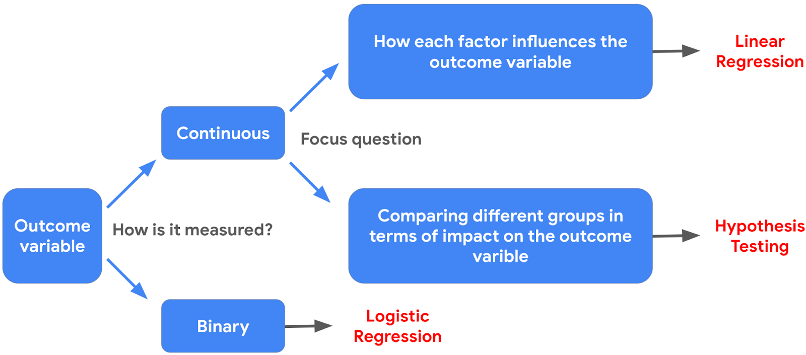

## Linear Regression

### Model Assumptions

#### 1. Linearity Assumption

* Each predictor variable $x_{i}$ is linearly related to the outcome varibale $y$

* Use scatter Plot Matrix

```python
sns.pairplot(penguins_final)
```


#### 2. Normality Assumption
* the residuals/errors are normally distributed
* **Method 1**: Check for bell shape curve
* **Method 2**: Quantile-Quantile (QQ) plot seee [QQ Plot Jupyter Notebook](qq_plot.ipynb)

#### 3. Independent Observation
* Each observation in the dataset is independent

#### 4. Homoscedasticity Assumption
* the variation of the residuals is constnt or similar across the model
    *  Looking for no clear pattern-- just scattered

> Note: Technical terms. *Residuals* are difference between predicted and observed values. *Errors* are natural noise in the model.


Jupyter Notebook: [Link](Activity_Run%20simple%20linear%20regression.ipynb)


### Metrics

### Regression Equation

$$
m = \frac{r \sigma(y)}{\sigma(x)}
$$
### Pearson's correlation, r

* Range: $[-1,1]$
* Formula

$$
r = \frac{cov(X,Y)}{\sigma(x) \sigma(y)}
$$
* For each increase of one standard deviation in $X$, there is an expected increase of $r$ standard deviations in $Y$, on average over $X$


##### Covariance $cov$
* Represent the extent to which $X$ and $Y$ vary together from their respective means

$$
cov(X,Y) = \frac{\sum\limits_{i=1}^{n} (x_{i} - \overline{x}) (y_{i} - \overline{y})}{n}
$$


### P-values

For regression analsyis,
* $H_0: \beta = 0$ (Beta-Coefficent = 0)
* $H_1: \beta \neq 0$ (Beta Coefficent is not 0)


### $R^{2}$: Coefficient of Determination
* Measures the proportion of variation in the dependent variable, $Y$ explained by the independent variable(s), X

> Example. Suppose $R^{2} =0.734$. This means that about $73.4\%$ of the variance in the dependent variable can be explained by the independent vairables. The other $\approx 27\%$ cannot be explained by the model

**Formula**

$$
R^2 = 1- \frac{\sum (y_i - \hat{y}_i)^2 }{\sum (y_i -\overline{y})^{2} }
$$

* Sum of Squares Residuals: Difference between actual v alues and predicted values (Top)

* Total Sum of Squares: Difference between actual values and mean value (Bottom)

### MAE (Mean Absolute Error)
* Regression metric that measures magnitude of errors

$$
\frac{1}{n} \sum \vert y_i - \hat{y}_i \vert
$$


### MSE (Mean Squared Error)

*  w/r MAE, MSE is more sensitive to outliers
$$
\frac{1}{n} \sum (y_i - \hat{y}_i)^{2}
$$


# Module 4

## Chi-Squared Test

### Purpose
**$\chi^{2}$ goodness of fit test** is a hypothesis tests that determines if the observed categorical value follows an expected distribution

### Procedure

#### Formula
$$
\chi^{2} = \sum \frac{ (O - E)^{2}}{E}
$$

#### Significance Level
* Use `Degrees of Freedom = Number of Categorical - 1` to find significance level and compare against $\chi^{2}$

### Code

```python
import scipy.stats as stats

stats.chisquare(f_obs, f_exp) # Returns (statistic/X^{2}, pvalue)
```


## Chi-Squared Test for Independence

### Purpose
A hypothesis test that determines whether or not two categorical vaqriables are associated


### Formula

* Calculate Expected Value for each cell via

$$
EV_{ij} = \frac{ \text{Column Total} \times \text{Row Total}}{ \text{Overall Total}}
$$

### Code

```python
import numpy as np
import scipy.stats as stats

stats.contingency.chi2_contingency(observed)
```

## ANOVA (Analysis of Variance)

### Purpose
A statistical technique that tests the difference of means between two groups

### Types of ANOVA

#### One-way ANOVA
Compares the means of one continuous dependent variables based on three or more groups for **one** categorical group

#### Two-way ANOVA
Compares the means of one continuous dependent variables based on three or more groups for **two** categorical 


### Procedure
1.  Calculate group means and overall mean
2.  Calculate the sum of squares between groups (SSB) and the sum of squares within groups (SSW)

#### Sum of Squares between groups (SSB)
$$
SSB = \sum\limits_{g \in G} n_{g} (M_{g} - M_G)^{2}
$$
* $n_g$: number of samples in the $g^{\text{th}}$ group
* $M_{g}$ mean of the $g^{\text{th}}$ group
* $M_{G}$ mean of the grand (overall) group

#### Sum of Squares within groups (SSW)

$$
SSW = \sum\limits_{g \in G} \sum\limits_{i \in I} (x_{gi} - M_{g})^{2}
$$
* $x_{gi}$: sample $i$ of the $g^{\text{th}}$ group
* $M_{g}$: mean of the $g^{\text{th}}$ group
> TLDR: Squared difference of each data with respect to the its group mean

3. Calculate mean squares for both SSB and SSW

#### Mean suqares between groups(MSSB)
$$
MSSB = \frac{SSB}{k-1}
$$
* $k$: number of groups

> $k-1$ is the degree of freedoms between groups

#### Mean squares within groups (MSSW)
$$
MSSW = \frac{SSW}{n-k}
$$
* $n:$ total number of samples in all groups
* $k:$ number of groups

> $n-k$ represents the degrees of freedom within groups

4. Compute the F-statistic
F- statistic is the ratio of the mean sum of squares between groups (MSSB) to the mean sum of squares within groups (MSSW)

$$
\text{F-statistic} = \frac{MSSB}{MSSW}
$$


5. Use the F-distribution and the F-statistic to get a p-value, which you use to decide whether to reject the null hypothesis


### Assumptions of ANOVA

1. Dependent values for each group comes from normal distribution 
    * Not the data as a whole, but *within each group*, normal distribution. 
    * Use Central Limit Theorem

2. Variance across groups are equal

3. Observations are independent of each other


### Code
```python

import statsmodels.api as sm
import statsmodels.formula.api as smf
import pandas as pd

model = ols(formula=ols_formula, data=data).fit()


sm.stats.anova_lm(model, typ=2)
'''
typ (str or int): Specifies the type of ANOVA Sum of Squares (SS). 
    typ=1 (default): Sequential sums of squares (order matters)
    typ=2: Partial sums of squares (assumes no interaction).
    typ=3: Partial sums of squares (accounts for interaction effects).

test (str): The test statistic to use. Defaults to "F", but can be "Chisq" (Chi-squared) or "Cp".

robust (str): Accepts values like hc3 to apply heteroscedasticity-corrected coefficient covariance matrices
'''
```
### ANOVA Post Hoc Test
Post hoc tests are follow-up analyses used after a statistically significant ANOVA to identify exactly which group means differ from one another. 

#### Code

```python
pairwise_tukeyhsd(endog = data["DV"], groups = data["C(IV)"]).summary()
```

## ANCOVA/MANOVA/MANCOVA

### ANCOVA
Analysis of covariances (ANCOVA) is a statistical technique that test the difference of means between three or more groups while controlling for the effects of covariance.


### MANOVA
Multi ANOVA is a statistical technique that compares how two, or more continuous outcome ​variables, vary according to categorical independent variables

### Jupyter Notebook


# Module 5

## Logistic Regression

### Logit
Mathematical function that transforms probabilities into "log-odds"

$f: [0,1) \rightarrow [-\infty, \infty]$

$$logit(p) = log (\frac{p}{1-p}) = \beta_0 + \sum\limits_{i \to n} \beta_i X_i$$

Confusion Matrix


Precision 

> Of all those predicted positive, how many are actually positive 


Recall
>  Of all those actually positive, how many are predicted to be positive

Accuracy
TODO

ROC Curve

TODO

# Module 6

