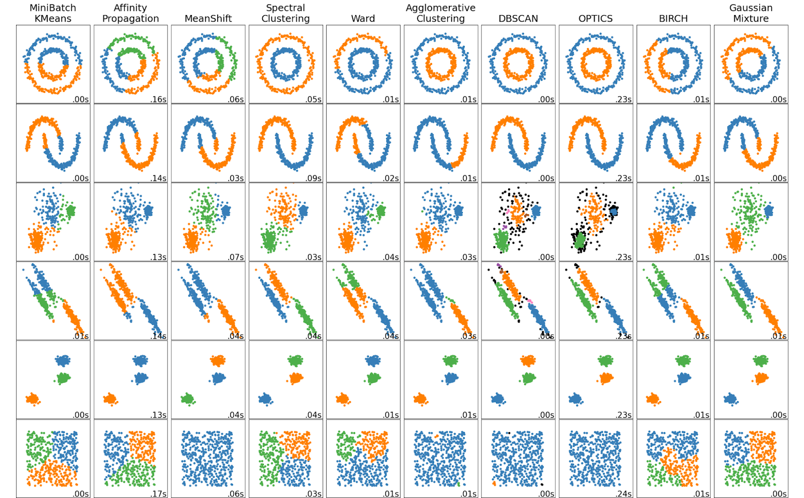

# Feature Engineering
* Process of using practical, statistical, and data science knowledge to select, transform, or extract characteristics, properties, and attributes from raw data

## Feature Selection
Process of picking variables from a dataset that will be used as predictor variables for your model. 

### Three types of features:

* **Predictive**: Features that by themselves contain information useful to predict the target                       
* **Interactive**: Features that are not useful by themselves to predict the target variable, but become predictive in conjunction with other features
* **Irrelevant**: Features that don't contain any useful information to predict the target

## Feature Transformation
* Feature transformation is a process where you take features that already exist in the dataset, and alter them so that they’re better suited to be used for training the model.

### Log normalization
* Take log of skewed feature to get a normal distribution

### Scaling - Normalization
`MinMaxScaler`: $\R \to [0,1]$ 

$$
\hat{x}_{i} = \frac{x_i - x_{min}}{x_{max} - x_{min}}
$$
### Scaling - Standardization

$$
\hat{x}_{i} = \frac{x_i - x_{mean}}{x_{s.t.d}}
$$

## Encoding
 process of converting categorical data to numerical data

## Feature extraction
Feature extraction involves producing new features from existing ones, with the goal of having features that deliver more predictive power to your model.

# Balancing Dataset
* Reason for Use: Require a model to be good at classifying things that occur relatively rarely in the data

## Downsampling
* Downsampling is the process of making the minority class represent a larger share of the whole dataset simply by removing observations from the majority class.

## Upsampling
Upsampling is basically the opposite of downsampling, and is done when the dataset doesn't have a very large number of observations in the first place.

# Naive Bayes

Bayes’ Theorem, an equation that can be used to calculate the probability of an outcome or class, given the values of predictor variables

$$
P(A | B) = \frac{P(B|A) \cdot P(A)}{P(B)}
$$

 => One of the biggest problems with Naive Bayes is features are truly conditionally independent features. It is something that is very rare in the world today. However, Naive Bayes models can still perform well even if the assumption of conditional independence is violated

### Sci-kit Learn

* `BernoulliNB`: Used for binary/Boolean features 

* `CategoricalNB`: Used for categorical features

* `ComplementNB`: Used for imbalanced datasets, often for text classification tasks

* `GaussianNB`: Used for continuous features, normally distributed features

* `MultinomialNB`: Used for multinomial (discrete) features

### Jupyter Notebook

# K-Means

### Clustering vs. Partitioning
Used interchangably but the differences lies in Partitioning algorithms don't consider unassigned points while Clustering algorithms do

## Metrics

### Inertia 
* Measurement of intracluster distance
$$
\sum\limits_{i=1}^{n} (x_{i} - C_{k})^{2}
$$
* $n$: number of observation in the data
* $x_{i}$: the location of a particular observation
* $C_{k}$: location of the centroid of cluster $k$, which is the cluster to which point $x_{i}$ is assigned

#### Evaluating Inertia

* Elbow Method: Line plot to visually compare the inertias of different models. Find where it starts to flatten out

### Sihouette Score

Silhouette score is the mean of the silhouette coefficients of all the observations in a k-means model

### Silhouette coefficient
* $f: \R \to [-1,1]$ where values closer to $1$ represesnts closer to its own cluster; likewise, $-1$ represents closer to points of another cluster

$$
\frac{(b-a)}{\max (a,b)}
$$
* $a$: mean distance between the instance and each other instance in the same cluster
* $b$: mean distance from the instance to each instance in the nearest other cluster 

## k-means++ 
* Randomly initializes centroids in the data, but it does so based on a probability calibration. 
    * Randomly chooses one point within the data to be the first centroid, then it uses other data points as centroids, selecting them pseudo-randomly. The probability that a point will be selected as a centroid increases the farther it is from other centroids. This helps to ensure that centroids aren’t initially placed very close together, which is when convergence in local minima is most likely to occur. 

## K-means Jupyter Notebooks

# Tree-Based Modelling

Decision trees are a flowchart-like structure that uses branching paths to predict the outcomes of events, the probability of certain outcomes, or to reach a decision. They can be used for classification problems, where a specific class or outcome is predicted—like whether or not a sports team will win a game.

## Splitting 
* Metrics to use to determine purity of a node & decision for splitting
* Goal is to always split based on highest purity
### Gini Impurity

$$
= 1 - \sum\limits_{i=1}^{N} P(i)^{2}
$$
* where $P(i)$ is the probability of samples belonging to class $i$ in a give node

* Scores clos
### Entropy

### Information Gain

### Log Loss

### Jupyter Notebooks

# Bagging

## Bootstrap Aggregation

Bootstrapping refers to sampling with replacement

## Ensemble learning

Ensemble learning refers to building multiple models and aggregating their predictions

## Random Forest
a bagging ensemble of decision trees but take it one step further by randomizing the features used to train each base learner, the result is called a random forest.